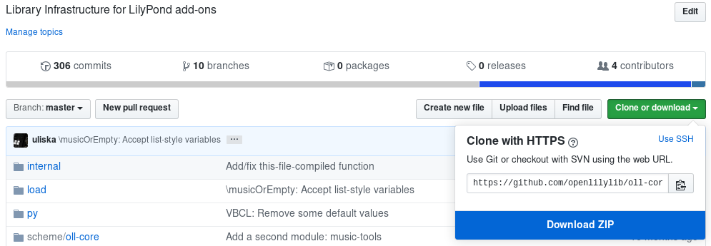

# Obtaining and Installing *openLilyLib*

“Installing” *openLilyLib* and its packages involves two steps: obtaining a copy
of the code and making it available to LilyPond.

## Obtaining *openLilyLib*

The source code of all desired packages has to be downloaded and stored within
an arbitrary “root” directory on the file system, for example (on Unix-like
systems) `~/oll-lib`. The official *openLilyLib* packages are hosted in the
“openlilylib” [GitHub organization](https://github.com/openlilylib), and all
repositories within that can be considered openLilyLib packages.

### Downloading Packages

On the repository page of an arbitrary package (the screenshot shows `oll-core`)
the complete package can be downloaded as a Zip archive and extracted to a
subdirectory of the *openLilyLib* root directory.



### Cloning With Git

The recommended way of obtaining the packages is by cloning them with Git, which
makes it much easier to update them, or to contribute with testing and/or
development. For this the package's Git URL is also available through the “Clone
or Download” button shown in the screenshot. Cloning is possible through HTTPS
or SSH, depending on your GitHub account (HTTPS doesn't need one).

```
cd ~
# Create root directory (first time only)
mkdir oll-lib
cd oll-lib
git clone https://github.com/openlilylib/oll-core.git
```

### Directory Layout

As said all packages are stored in subdirectories of a common root. The minimum
setup includes the [oll-core}(../oll-core/index.html) package, but usually other
packages will be used too. Some packages make use of other packages (i.e. they
“depend” on them), which is expected to be part of the package's documentation.

An installation of *openLilyLib* with the [page-layout](../page-layout/index.html) package (which depends on [breaks](../breaks/index.html) and [edition-engraver](../edition-engraver/index.md)) would therefore look like this:

```
~/
 /oll-lib
   /oll-core
   /breaks
   /edition-engraver
   /page-layout
```

## Making *openLilyLib* Available

In order to be used by LilyPond the downloaded packages have to be made
available to LilyPond. This is done by adding the *openLilyLib* root directory
to LilyPond's search path with the `-I` command line option:

```
lilypond -I ~/oll-lib path/to/file.ly
```

will do that for the current compilation process.

In order not to have to add this to every compilation command it is possible to
create a wrapper script, which may be a good idea for a variety of use cases
anyway.

When using [Frescobaldi](http://frescobaldi.org) as an editing environment this
is not necessary because search paths can be added and persistently stored
within Frescobaldi.

## Using Frescobaldi

In the near future (hopefully starting with version 3.2 or 3.3) Frescobaldi will
provide support for *openLilyLib*, including searching for, downloading, and
installing *openLilyLib*, but currently (Feb 2020) this has not been
implemented.
